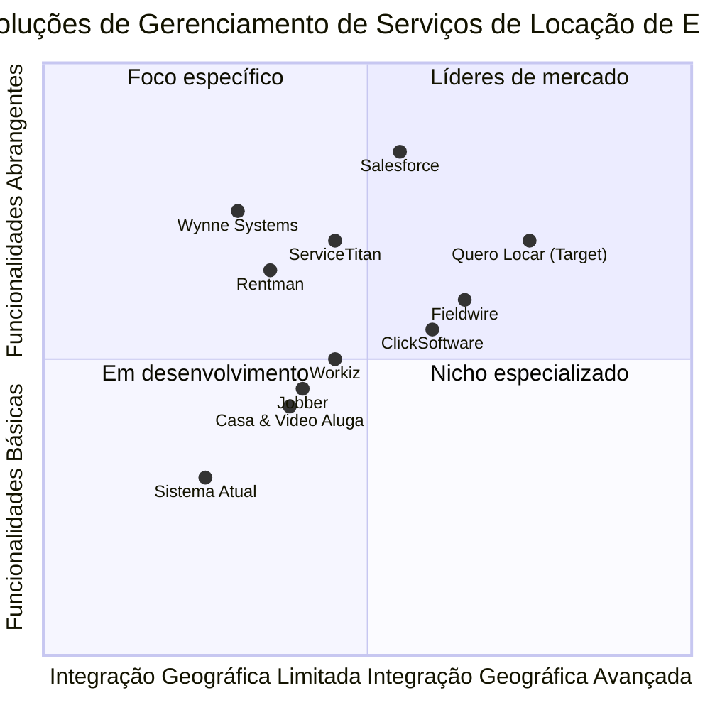

# Documento de Requisitos de Produto (PRD): Sistema Quero Locar

**Versão:** 1.0  
**Última Atualização:** 09 de Julho de 2025  
**Preparado por:** Emma, Product Manager

## Sumário
1. [Informações do Projeto](#1-informações-do-projeto)
2. [Definição do Produto](#2-definição-do-produto)
   - [Objetivos do Produto](#21-objetivos-do-produto)
   - [Histórias de Usuário](#22-histórias-de-usuário)
   - [Análise Competitiva](#23-análise-competitiva)
   - [Quadrante Competitivo](#24-quadrante-competitivo)
3. [Especificações Técnicas](#3-especificações-técnicas)
   - [Análise de Requisitos](#31-análise-de-requisitos)
   - [Pool de Requisitos](#32-pool-de-requisitos)
   - [Esboço de Design de UI](#33-esboço-de-design-de-ui)
   - [Questões em Aberto](#34-questões-em-aberto)
4. [Especificação Técnica Detalhada](#4-especificação-técnica-detalhada)
   - [Arquitetura de Microfrontends](#41-arquitetura-de-microfrontends)
   - [Integração com Mapbox](#42-integração-com-mapbox)
   - [Funcionalidade Offline](#43-funcionalidade-offline)
   - [Arquitetura de Microserviços](#44-arquitetura-de-microserviços)
5. [Especificação de Negócio para Locação de Equipamentos de Construção](#5-especificação-de-negócio-para-locação-de-equipamentos-de-construção)
   - [Tipos de Equipamentos e Características](#51-tipos-de-equipamentos-e-características)
   - [Processos de Negócio](#52-processos-de-negócio)
   - [Regras de Preços e Disponibilidade](#53-regras-de-preços-e-disponibilidade)
   - [Integração com Fornecedores](#54-integração-com-fornecedores)
6. [Identidade Visual](#6-identidade-visual)
   - [Conceito e Diretrizes para Logo](#61-conceito-e-diretrizes-para-logo)
   - [Aplicações da Identidade Visual](#62-aplicações-da-identidade-visual)
   - [Considerações Técnicas](#63-considerações-técnicas)
7. [Conclusão](#7-conclusão)

## 1. Informações do Projeto

**Idioma:** Português  
**Linguagem de Programação Frontend:** Vue.js  
**Linguagem de Programação Backend:** JavaScript/TypeScript (Node.js)  
**Nome do Projeto:** Quero Locar  
**Requisitos Originais:** Desenvolvimento de um sistema web com frontend em Vue.js, arquitetura de microserviços e integração com a API do Mapbox para gerenciamento de serviços de locação baseados em localização, especificamente para caçambas de entulhos, betoneiras, andaimes, carretinhas de poda e equipamentos similares.

## 2. Definição do Produto

### 2.1 Objetivos do Produto

1. **Gerenciar serviços de locação com componente geográfico:** Permitir o registro, visualização e acompanhamento de diferentes tipos de equipamentos de construção (caçambas de entulho, betoneiras, andaimes, carretinhas de poda) em um mapa interativo, facilitando a gestão da frota e otimizando a distribuição geográfica.

2. **Facilitar processos financeiros e administrativos:** Integrar funcionalidades de controle financeiro, notificações e gerenciamento de clientes para centralizar operações de negócio, incluindo rastreamento de contratos, pagamentos e manutenção de equipamentos.

3. **Fornecer acesso offline e sincronização de dados:** Garantir que o sistema funcione mesmo sem conexão constante com a internet, sincronizando dados quando a conexão for restabelecida, essencial para operações em canteiros de obras e áreas remotas.

### 2.2 Histórias de Usuário

1. **Como administrador da locadora**, quero visualizar todos os equipamentos ativos em um mapa interativo, para monitorar e gerenciar eficientemente a distribuição geográfica dos recursos e otimizar o atendimento de novas solicitações.

2. **Como gerente financeiro**, quero acessar relatórios financeiros relacionados aos serviços por localização e tipo de equipamento, para analisar a rentabilidade por região e categoria de produto.

3. **Como cliente (empreiteiro/construtor)**, quero solicitar um orçamento para locação de equipamentos específicos através do portal de clientes, especificando período de locação e localização de entrega, para contratar serviços de forma conveniente.

4. **Como representante de campo**, quero registrar novas entregas, retiradas e inspeções de equipamentos mesmo sem acesso à internet, para continuar trabalhando em áreas de construção com conectividade limitada.

5. **Como supervisor de operações**, quero receber notificações sobre mudanças no status dos equipamentos (entregas, retiradas, manutenções), para responder rapidamente a quaisquer problemas ou oportunidades.

6. **Como coordenador de manutenção**, quero acompanhar o histórico de uso e manutenção de cada equipamento, para programar serviços preventivos e reduzir tempo de inatividade.

7. **Como cliente**, quero acompanhar em tempo real o status da minha solicitação e a localização do equipamento solicitado, para planejar adequadamente as atividades do canteiro de obras.

### 2.3 Análise Competitiva

| Produto | Prós | Contras |
|---------|------|---------|
| Sistema Atual | Familiaridade com processos internos | Interface desatualizada, sem integração com mapas, sem funcionalidade offline |
| Fieldwire | Bom mapeamento de projetos, colaboração em tempo real | Foco voltado para construção civil, menos adaptado para serviços de locação de equipamentos |
| Salesforce Field Service | Sistema robusto de gestão de serviços, grande ecossistema | Custo elevado, complexidade de implementação, menos especializado em locações de equipamentos de construção |
| ServiceTitan | Boas funcionalidades para agendamento e despacho | Foco em serviços residenciais, menos adaptável para locação de equipamentos pesados |
| ClickSoftware | Otimização de rotas, programação inteligente | Interface menos intuitiva, integração de mapas limitada |
| Jobber | Interface amigável, bom para pequenas empresas | Recursos limitados para operações em larga escala de equipamentos diversos |
| Workiz | Bom acompanhamento de serviços, interface moderna | Menos recursos para integração de mapas e gerenciamento de locações específicas de equipamentos de construção |
| Rentman | Especializado em locação de equipamentos | Menos recursos para geolocalização e funcionamento offline |
| Wynne Systems | Solução completa para locação de equipamentos pesados | Alto custo, curva de aprendizado íngreme, menos adaptável ao mercado brasileiro |
| Casa & Video Aluga | Reconhecimento de marca no Brasil, integração com rede de varejo física | Seleção limitada de equipamentos, presença regional restrita |

### 2.4 Quadrante Competitivo


## 3. Especificações Técnicas

### 3.1 Análise de Requisitos

O sistema Quero Locar será estruturado em uma arquitetura de microfrontends e microserviços, com componentes independentes que se comunicam através de APIs REST. A aplicação será construída utilizando Vue.js no frontend, com uma abordagem de microfrontends gerenciados através de Module Federation, permitindo desenvolvimento e implantação independentes de cada módulo da UI.

A integração com o Mapbox é um componente central do sistema, fornecendo visualização interativa de equipamentos de construção geograficamente distribuídos, com foco especial em:

1. Visualização de diferentes tipos de equipamentos (caçambas, betoneiras, andaimes, carretinhas) com ícones distintos
2. Filtros para status do equipamento (disponível, em uso, em manutenção, em trânsito)
3. Rotas otimizadas para entregas e retiradas
4. Cálculo automático de distâncias e tempos de deslocamento para cotações

O sistema deve funcionar offline usando armazenamento local (IndexedDB) e sincronizar metadados quando a conexão estiver disponível, essencial para operação em canteiros de obras remotos.

O backend será composto por microserviços especializados, cada um responsável por um domínio específico do negócio (autenticação, gestão de equipamentos, contratos, finanças, notificações, mapas, portal do cliente).

### 3.2 Pool de Requisitos

#### 3.2.1 P0 (Must Have - Essencial)

1. Sistema de autenticação e controle de acesso baseado em papéis (administrador, operador, cliente, gerente financeiro)
2. Cadastro e gerenciamento de equipamentos de construção com especificações técnicas detalhadas:
   - Caçambas de entulho (capacidades, dimensões)
   - Betoneiras (capacidade, potência)
   - Andaimes (tipo, altura, capacidade de carga)
   - Carretinhas de poda (dimensões, capacidade)
3. Visualização de equipamentos em mapa interativo usando Mapbox, com diferenciação visual por tipo e status
4. Sistema de agendamento e controle de disponibilidade dos equipamentos
5. Funcionalidade offline com sincronização quando conectado
6. Geração de contratos e propostas de locação
7. API para integração entre microserviços
8. Armazenamento seguro de dados de usuários e equipamentos

#### 3.2.2 P1 (Should Have - Importante)

1. Sistema de notificações para entregas, retiradas e manutenções programadas
2. Relatórios financeiros por tipo de equipamento, cliente e localização
3. Portal do cliente para solicitação de orçamentos e acompanhamento de locações ativas
4. Dashboard administrativo com KPIs de utilização da frota e rentabilidade
5. Filtros avançados para visualização de equipamentos no mapa
6. Sistema de busca por endereço e geocodificação
7. Gestão de manutenção preventiva e corretiva dos equipamentos
8. Histórico de uso e ocorrências por equipamento
9. Alertas automáticos para renovação de contratos próximos do vencimento

#### 3.2.3 P2 (Nice to Have - Desejável)

1. Análise preditiva de demanda por região e tipo de equipamento
2. Integração com sistemas de pagamento online
3. App móvel nativo para Android/iOS para acompanhamento em campo
4. Otimização de rotas para entregas e retiradas múltiplas
5. Chatbot para atendimento automatizado e cotações rápidas
6. Integração com sistemas de contabilidade
7. Módulo de avaliação de satisfação do cliente
8. Sistema de recomendação para equipamentos complementares
9. Monitoramento remoto de equipamentos via IoT (horas de uso, localização exata, status operacional)

### 3.3 Esboço de Design de UI

#### 3.3.1 Visão Geral da Arquitetura

O sistema Quero Locar seguirá uma arquitetura de microfrontends com os seguintes módulos:

1. **Shell App**: Aplicação principal que hospeda os outros microfrontends
2. **MF-Auth**: Microfrontend de autenticação
3. **MF-EquipmentManager**: Microfrontend para gerenciamento de equipamentos de construção
4. **MF-Finance**: Microfrontend para gestão financeira e contratos
5. **MF-Notifications**: Microfrontend para sistema de notificações
6. **MF-Map**: Microfrontend para integração com Mapbox
7. **MF-Client-Portal**: Microfrontend para o portal do cliente
8. **MF-Maintenance**: Microfrontend para gestão de manutenção de equipamentos

Cada microfrontend será uma aplicação Vue.js independente, compartilhando recursos comuns através de Module Federation.

#### 3.3.2 Principais Telas

1. **Dashboard Principal**:
   - Mapa interativo central mostrando todos os equipamentos ativos
   - Painel lateral com filtros por tipo de equipamento, status e disponibilidade
   - Barra superior com notificações e acesso a módulos
   - Resumo de KPIs: taxa de utilização da frota, receita diária, equipamentos em manutenção

2. **Gestão de Equipamentos**:
   - Formulários específicos para cadastro de diferentes tipos de equipamento
   - Visualização em lista/grade com detalhes técnicos e fotos
   - Opção de visualização no mapa
   - Histórico detalhado por equipamento (locações, manutenções, incidentes)
   - Calendário de disponibilidade

3. **Portal do Cliente**:
   - Área de login/registro
   - Dashboard do cliente mostrando equipamentos atualmente locados
   - Formulário de solicitação de orçamentos com seleção de tipo de equipamento, período e localização
   - Visualização de histórico de locações e status de pedidos atuais
   - Área para upload de documentos necessários (comprovantes, seguros)

4. **Módulo Financeiro**:
   - Relatórios gráficos de faturamento por categoria de equipamento
   - Listagem de contratos ativos e histórico
   - Controle de pagamentos e inadimplência
   - Filtros por período, tipo de equipamento e cliente
   - Análise de rentabilidade por equipamento e região

5. **Gestão de Manutenção**:
   - Calendário de manutenções programadas
   - Histórico de manutenções por equipamento
   - Alertas para manutenções preventivas baseadas em tempo de uso
   - Registro de peças substituídas e custos associados

6. **Tela de Mapa Operacional**:
   - Visualização em tempo real de todos os equipamentos
   - Filtros avançados por tipo, status, cliente
   - Camadas para diferentes categorias de equipamento
   - Ferramentas de medição de distância para estimativas de entrega
   - Rotas otimizadas para equipes de entrega e coleta

### 3.4 Questões em Aberto

1. **Integração com sistemas legados**: Como será feita a migração de dados de sistemas existentes de gestão de equipamentos? Há necessidade de manter alguma integração permanente?

2. **Escala do sistema**: Qual é o tamanho atual da frota de equipamentos e o volume esperado de crescimento nos próximos anos? Qual é o número de usuários simultâneos esperado?

3. **Requisitos específicos para cada tipo de equipamento**: Existem necessidades específicas de rastreamento ou documentação para diferentes categorias de equipamento (ex: certificações para andaimes, licenças especiais para certos equipamentos)?

4. **Estratégia de backup e recuperação**: Como serão tratados os dados em caso de falha do sistema, especialmente considerando operações offline?

5. **Métricas de desempenho**: Quais são os SLAs (Service Level Agreements) para tempo de resposta e disponibilidade do sistema, considerando o uso em campo?

6. **Integrações com fornecedores**: O sistema precisará se integrar com sistemas de fornecedores para equipamentos sublocados?

## 4. Especificação Técnica Detalhada

### 4.1 Arquitetura de Microfrontends

A arquitetura de microfrontends será implementada usando Webpack Module Federation para Vue.js, permitindo:

- Desenvolvimento independente de cada módulo
- Implantação independente
- Compartilhamento de componentes comuns
- Compartilhamento de estado (quando necessário) usando Pinia

O sistema utilizará a seguinte estrutura de organização para código:

```
/src
  /microfrontends
    /shell              # Aplicação principal
    /auth               # Autenticação e gerenciamento de usuários
    /equipment-manager  # Gestão de equipamentos
    /finance            # Gestão financeira e contratos
    /notifications      # Sistema de notificações
    /map                # Integração com Mapbox
    /client-portal      # Portal do cliente
    /maintenance        # Gestão de manutenção
  /shared               # Componentes e utilitários compartilhados
    /components         # Componentes Vue reutilizáveis
    /api                # Serviços de API
    /utils              # Utilitários
    /types              # Definições de tipos TypeScript
    /store              # Estado compartilhado (Pinia)
```

### 4.2 Integração com Mapbox

A integração com o Mapbox será feita através do módulo MF-Map, que irá:

- Implementar um componente Vue.js reutilizável para exibição de mapas
- Fornecer controles personalizados para interação com o mapa
- Implementar marcadores customizados para diferentes tipos de equipamento:
  - Caçambas de entulho: ícones customizados por tamanho
  - Betoneiras: ícones diferenciados por capacidade
  - Andaimes: representação visual por tipo e altura
  - Carretinhas de poda: ícones específicos
- Permitir clustering de marcadores quando necessário
- Implementar geocodificação para busca de endereços
- Calcular rotas otimizadas para entregas e retiradas
- Fornecer estimativas de tempo de deslocamento
- Implementar camadas de visualização para diferentes status (disponível, em uso, em manutenção)

Recursos específicos para o setor de locação de equipamentos de construção:

- Cálculo automático de área de cobertura por tipo de equipamento
- Visualização de zonas de entrega com preços diferenciados
- Suporte para geofencing para alertas quando equipamentos saem de áreas autorizadas

### 4.3 Funcionalidade Offline

A funcionalidade offline será implementada usando:

- Service Workers para cache de recursos estáticos
- IndexedDB para armazenamento local de dados
- Sistema de fila para operações realizadas offline
- Sincronização automática quando a conexão é restaurada

Para o contexto específico de equipamentos de construção, o sistema irá:

- Armazenar localmente fichas técnicas completas de equipamentos para consulta offline
- Permitir registro fotográfico de condições dos equipamentos na entrega/retirada
- Manter contratos e documentos essenciais disponíveis offline
- Possibilitar assinaturas digitais mesmo sem conexão
- Armazenar mapas das áreas de operação frequente para navegação offline

### 4.4 Arquitetura de Microserviços

Os seguintes microserviços compõem o backend:

1. **Login-Service**: Autenticação de usuários
2. **Auth-Service**: Autorização e controle de acesso
3. **Equipment-Service**: Gerenciamento de equipamentos e sua localização
4. **Contract-Service**: Gestão de contratos e agendamentos
5. **Finance-Service**: Gestão financeira
6. **Map-Service**: Processamento de dados geográficos
7. **Notification-Service**: Sistema de notificações
8. **Client-Portal-Service**: Serviços para o portal do cliente
9. **Maintenance-Service**: Gestão de manutenção e peças

Cada microserviço será independente, com seu próprio banco de dados e API REST.

## 5. Especificação de Negócio para Locação de Equipamentos de Construção

### 5.1 Tipos de Equipamentos e Características

O sistema deve suportar os seguintes tipos de equipamentos com suas características específicas:

#### 5.1.1 Caçambas de Entulho

- **Atributos específicos**:
  - Capacidade (m³): 3m³, 5m³, 7m³, 10m³
  - Material: Metal, Polipropileno
  - Cor (para identificação visual)
  - Tipo de resíduo compatível: Construção civil, material vegetal, resíduos mistos
  - Dimensões (comprimento, largura, altura)
  - Peso vazio
  - Capacidade máxima de carga (kg)

- **Processos específicos**:
  - Tempo de permanência padrão (dias)
  - Restrições municipais por zona
  - Necessidade de autorizações especiais
  - Verificação de acesso para veículo de entrega

#### 5.1.2 Betoneiras

- **Atributos específicos**:
  - Capacidade (litros): 120L, 150L, 400L, 600L
  - Tipo de motor: Elétrico, Combustão
  - Potência (HP)
  - Voltagem (para elétricas): 110V, 220V, 380V
  - Rotação (RPM)
  - Mobilidade: Fixa, Rebocável
  - Dimensões

- **Processos específicos**:
  - Checklist operacional
  - Requisitos de alimentação elétrica
  - Instruções de segurança específicas
  - Treinamento requerido para operação

#### 5.1.3 Andaimes

- **Atributos específicos**:
  - Tipo: Fachadeiro, Multidirecional, Torre, Suspenso
  - Material: Aço, Alumínio
  - Altura máxima
  - Capacidade de carga por m²
  - Módulos disponíveis
  - Certificações de segurança
  - Acessórios inclusos: Plataformas, Rodízios, Escadas

- **Processos específicos**:
  - Certificação requerida para montagem
  - Responsável técnico
  - Projeto de montagem
  - Inspeção periódica
  - ART (Anotação de Responsabilidade Técnica) quando aplicável

#### 5.1.4 Carretinhas de Poda

- **Atributos específicos**:
  - Capacidade de carga (kg)
  - Dimensões (comprimento, largura, altura)
  - Tipo de engate
  - Tipo de freio
  - Sistema de basculamento
  - Documentação (placa, licenciamento)
  - Equipamentos obrigatórios

- **Processos específicos**:
  - Verificação de documentação do veículo rebocador
  - Habilitação requerida
  - Licenças ambientais para transporte de resíduos vegetais
  - Limite de velocidade recomendado

### 5.2 Processos de Negócio

O sistema deve suportar os seguintes processos de negócio específicos para locação de equipamentos de construção:

#### 5.2.1 Ciclo de Vida da Locação

1. **Solicitação de Orçamento**
   - Cliente informa tipo de equipamento, período, localização
   - Sistema calcula automaticamente preço com base em distância e tempo
   - Verificação automática de disponibilidade

2. **Aprovação e Contratação**
   - Geração de contrato digital
   - Upload de documentação necessária
   - Agendamento de entrega
   - Processamento de pagamento antecipado ou caução

3. **Entrega do Equipamento**
   - Geração de rota otimizada para equipe de entrega
   - Checklist digital de condições do equipamento
   - Registro fotográfico do estado
   - Assinatura digital do cliente
   - Instruções de segurança fornecidas

4. **Monitoramento Durante o Uso**
   - Verificações programadas (para locações longas)
   - Notificações de fim de período se aproximando
   - Solicitações de extensão do período

5. **Retirada do Equipamento**
   - Agendamento de coleta
   - Verificação de condições na devolução
   - Registro de danos ou problemas
   - Cálculo de valores adicionais (se aplicável)
   - Emissão de nota fiscal

#### 5.2.2 Gestão de Manutenção

1. **Manutenção Preventiva**
   - Agendamento baseado em tempo ou uso
   - Checklists específicos por tipo de equipamento
   - Histórico completo de serviços realizados

2. **Manutenção Corretiva**
   - Registro de falhas reportadas
   - Diagnóstico e orçamento
   - Acompanhamento de reparos
   - Impacto na disponibilidade

3. **Gestão de Peças e Suprimentos**
   - Inventário de peças comuns
   - Alertas de estoque baixo
   - Vinculação de peças a equipamentos específicos

### 5.3 Regras de Preços e Disponibilidade

O sistema deve implementar as seguintes regras de negócio para precificação e disponibilidade:

1. **Estrutura de Preços**
   - Preço base diário/semanal/mensal por tipo de equipamento
   - Sobretaxas por distância de entrega
   - Descontos por volume ou tempo estendido
   - Preços diferenciados para horários de pico
   - Taxas adicionais para serviços complementares

2. **Regras de Disponibilidade**
   - Bloqueios para manutenção programada
   - Verificação de conflitos de agendamento
   - Reservas antecipadas
   - Lista de espera para equipamentos populares

3. **Políticas de Cancelamento**
   - Prazos para cancelamento sem custo
   - Taxas de cancelamento por prazo
   - Remarcações e alterações

### 5.4 Integração com Fornecedores

Para equipamentos que são sublocados de fornecedores parceiros, o sistema deve incluir:

1. **Gestão de Fornecedores**
   - Cadastro de fornecedores parceiros
   - Contratos e acordos comerciais
   - Histórico de relacionamento

2. **Fluxo de Sublocação**
   - Verificação automática de necessidade de sublocação
   - Solicitação para fornecedores
   - Acompanhamento de status
   - Gestão financeira diferenciada (comissões vs. locação direta)

3. **Indicadores de Desempenho**
   - Qualidade dos equipamentos sublocados
   - Pontualidade nas entregas
   - Resposta a solicitações urgentes
   - Competitividade de preços

## 6. Identidade Visual

### 6.1 Conceito e Diretrizes para Logo

A identidade visual do Quero Locar deve transmitir confiança, praticidade e inovação tecnológica, alinhando-se com a proposta de valor da plataforma como um sistema de gerenciamento de locação baseado em localização. Baseado nas análises de mercado e tendências do setor, recomendamos as seguintes diretrizes para o desenvolvimento da logo:

#### 6.1.1 Elementos Visuais Recomendados

1. **Símbolo de Localização/Pin de Mapa**
   - Um marcador de localização estilizado que represente a funcionalidade central de geolocalização
   - Possivelmente combinado com elementos que sugiram os equipamentos de construção (caçamba, betoneira, andaime)

2. **Tipografia**
   - Fonte moderna e limpa, sem serifa, para comunicar inovação e facilidade de uso
   - Peso médio a bold para garantir boa visibilidade em tamanhos diferentes
   - Ligeira personalização de algumas letras para criar distinção (como modificação no "Q" de Quero)

3. **Paleta de Cores**
   - **Primária**: Tons de azul (RGB: 25, 118, 210) para transmitir confiabilidade e profissionalismo
   - **Secundária**: Verde-azulado (RGB: 0, 151, 167) para representar inovação e tecnologia
   - **Acentuação**: Laranja (RGB: 255, 145, 0) ou amarelo (RGB: 255, 193, 7) para elementos que precisam chamar atenção, trazendo associação com construção e equipamentos

4. **Conceito Visual**
   - Design que funcione bem tanto em formato horizontal (para site) quanto em formato quadrado/circular (para ícone de app)
   - Simplicidade visual que permita reconhecimento instantâneo
   - Incorporação sutil de elementos que representem os serviços de locação (caçambas, betoneiras, andaimes, carretinhas)

#### 6.1.2 Proposta Conceitual

A logo do Quero Locar deve combinar um marcador de localização estilizado fundido com silhuetas simplificadas dos principais equipamentos oferecidos. Uma sugestão conceitual é um pin de mapa com a letra "Q" integrada, onde parte da cauda do "Q" sugere uma caçamba ou betoneira. O nome completo "Quero Locar" deve aparecer ao lado ou abaixo em fonte moderna sem serifa.

Tagline sugerida: "Encontre. Alugue. Construa."

### 6.2 Aplicações da Identidade Visual

A identidade visual deve ser consistentemente aplicada em todos os pontos de contato:

1. **Interface do Aplicativo**
   - Ícones e elementos visuais que seguem a mesma linguagem da logo
   - Paleta de cores consistente em toda a interface
   - Elementos de mapa e localização que dialoguem visualmente com a logo

2. **Website**
   - Header com versão horizontal da logo
   - Footer com versão compacta
   - Favicon baseado no símbolo principal da logo

3. **Material de Marketing**
   - Templates para mídias sociais
   - Materiais impressos com adaptações apropriadas da logo
   - Assinaturas de email e comunicação digital

4. **Aplicações em Mapas**
   - Pins personalizados para marcadores no mapa que sigam a identidade visual
   - Pop-ups e informações geográficas com consistência visual

### 6.3 Considerações Técnicas

1. **Formatos de Arquivo**
   - SVG para uso web e garantia de escalabilidade
   - PNG com transparência em múltiplas resoluções para aplicações diversas
   - PDF vetorial para materiais impressos

2. **Responsividade**
   - Versões alternativas para diferentes tamanhos de tela
   - Versão simplificada para ícones muito pequenos
   - Manutenção da legibilidade em todas as escalas

3. **Acessibilidade**
   - Contraste adequado entre cores para garantir visibilidade
   - Versões monocromáticas para situações específicas
   - Consideração das diretrizes WCAG para uso em interfaces digitais

## 7. Conclusão

O sistema Quero Locar representa uma solução moderna e abrangente para a gestão de locação de equipamentos de construção civil, com forte integração geográfica e suporte a operações online e offline. O foco em uma experiência de usuário intuitiva, aliado às capacidades avançadas de mapeamento e gerenciamento de recursos, posiciona o produto como uma solução inovadora no mercado brasileiro.

A arquitetura proposta, baseada em microfrontends e microserviços, garante escalabilidade e flexibilidade para acomodar o crescimento futuro e a adição de novas funcionalidades. A integração com o Mapbox fornece capacidades geográficas robustas que diferenciam o produto da concorrência.

As especificações detalhadas para cada tipo de equipamento (caçambas, betoneiras, andaimes e carretinhas) asseguram que o sistema atenda às necessidades específicas do setor de locação de equipamentos de construção, proporcionando uma solução verdadeiramente especializada.

A identidade visual proposta, centrada em um conceito que combina geolocalização com elementos da construção civil, ajudará a estabelecer uma marca forte e reconhecível, facilitando a adoção e fidelização de usuários.

Recomenda-se que o desenvolvimento siga uma abordagem iterativa, priorizando os requisitos P0 na primeira fase, seguidos pelos P1 e P2 em fases subsequentes. Testes com usuários reais devem ser conduzidos em cada iteração para garantir que o produto atenda efetivamente às necessidades do mercado.
